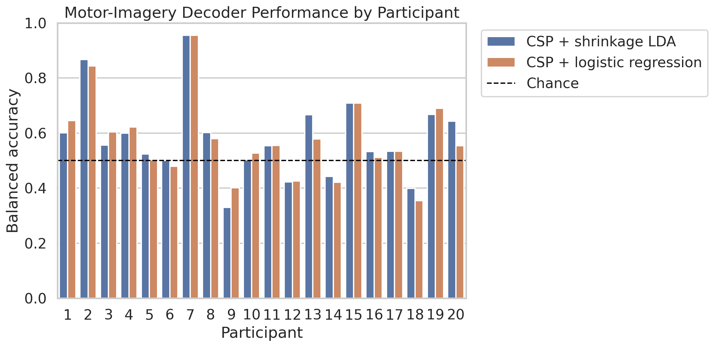
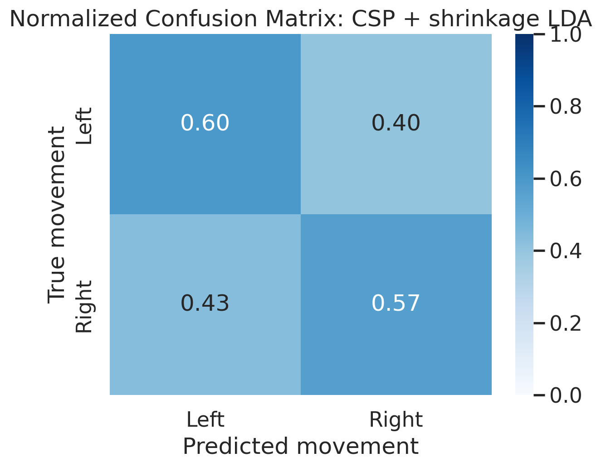
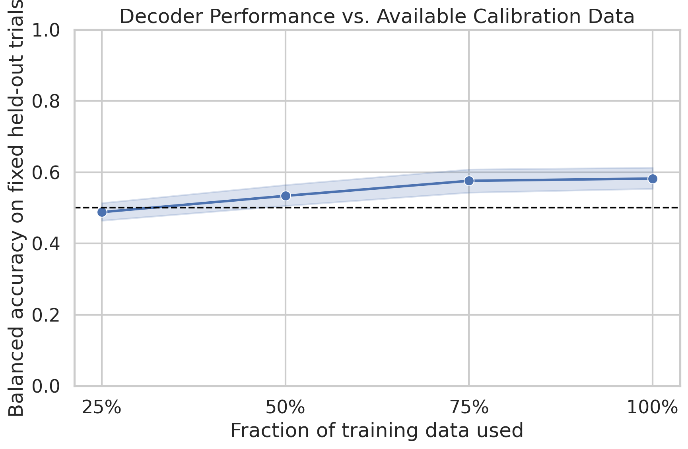
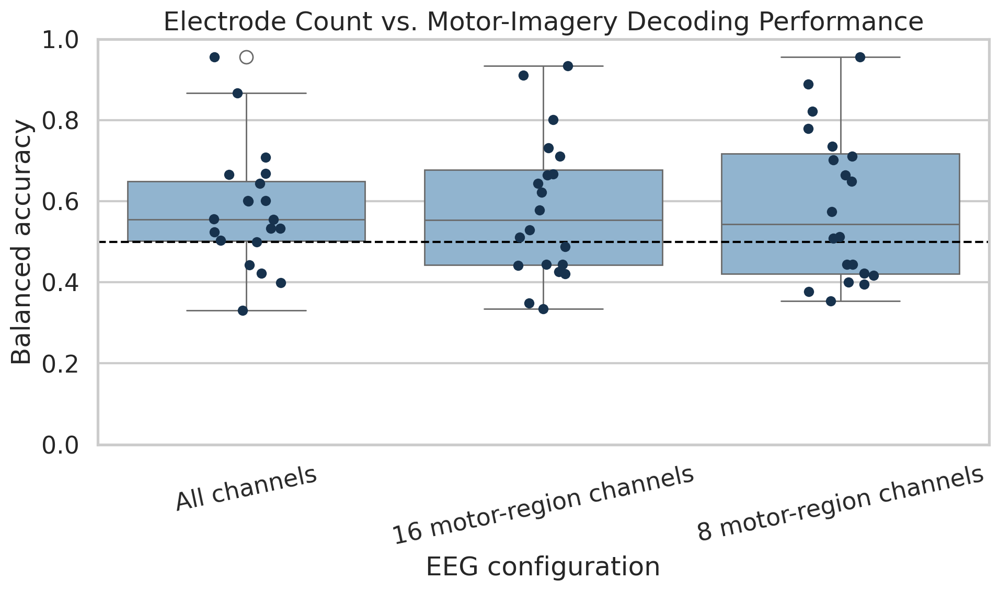

# Motor-imagery EEG decoding: accuracy is only part of the problem

**Yabsera Negussie**  
Python · MNE · scikit-learn · PhysioNet EEGBCI

I built this analysis because BCI results are often reduced to the highest accuracy in a table. That number matters, but it does not answer some of the questions that matter most outside a controlled demonstration: Does the decoder work consistently across people? How much calibration does a new user need? What happens if the EEG setup is made smaller?

I used imagined left- versus right-fist movement as a simple test case and evaluated three things together: decoder performance, calibration burden, and electrode count. The final analysis contains 20 participants and 900 trials from the [PhysioNet EEG Motor Movement/Imagery Database](https://physionet.org/content/eegmmidb/1.0.0/).

## The analysis in brief

For each participant, I downloaded imagery runs 4, 8, and 12, filtered the EEG from 8–30 Hz, and extracted epochs from 0.5–3.5 seconds after the task cue. I compared two pipelines:

- Common Spatial Patterns (CSP) with shrinkage LDA
- CSP with standardized logistic regression

I evaluated each person separately with shuffled, stratified five-fold cross-validation. CSP stayed inside the scikit-learn pipeline, so its spatial filters were learned only from the training folds. I used balanced accuracy as the primary metric because it gives each movement class equal weight, even when a participant had 21 versus 24 usable trials.

I chose a participant-specific design on purpose. The question here is how well a decoder works after calibrating it to one user. A cross-participant model would answer a different and harder question about zero- or low-calibration transfer.

## What happened when I increased the sample

I first ran the entire notebook with five participants to check data loading, class labels, plotting, and cross-validation. In that small run, logistic regression appeared better than LDA: 0.643 versus 0.629 mean balanced accuracy.

After I expanded the cohort to 20 participants, the order reversed and both averages decreased. LDA reached 0.580 and logistic regression reached 0.575. The paired difference was not significant (p = 0.758). That change was useful: it showed how easily a small development sample could have led me to select the wrong “winner.” All final figures and saved results use the 20-participant cohort.

## Results

| Decoder | Mean balanced accuracy | SD | Median | Mean macro F1 |
|---|---:|---:|---:|---:|
| CSP + shrinkage LDA | **0.580** | 0.149 | 0.555 | **0.579** |
| CSP + logistic regression | 0.575 | 0.146 | 0.555 | 0.572 |



The small mean difference between the models was much less important than the difference between participants. LDA scores ranged from 0.330 to 0.956, and 15 of 20 participants scored above 0.50. The participant-level bootstrap interval around the LDA mean was 0.519–0.647. A one-sided Wilcoxon signed-rank test placed the group above chance (p = 0.016), although this remains an exploratory result because I selected and evaluated the model in the same cohort.

The pooled out-of-fold confusion matrix was also fairly balanced. The model correctly classified 60% of left-hand trials and 57% of right-hand trials, so the average was not being held up by a strong preference for one class.



## How much calibration was useful?

I held out 30% of each participant's trials and kept that test partition fixed. Within the remaining training partition, I fit the LDA pipeline with progressively larger subsets. Subsampling was repeated five times so that a single favorable subset would not determine the curve.

| Fraction of available training data | Mean training trials | Held-out balanced accuracy |
|---|---:|---:|
| 25% | 7 | 0.488 |
| 50% | 15 | 0.534 |
| 75% | 23 | 0.576 |
| 100% | 31 | 0.582 |



Training fraction mattered overall (Friedman p = 0.012), but the final eight training trials added very little to the cohort mean. Performance at 75% was about 99% of the full-calibration mean, and the paired 75% versus 100% comparison was not significant (p = 0.601).

I would not interpret this as proof that 23 trials are enough. There are too few trials and too much participant variation for that claim. I interpret it as a practical next question: could a shorter calibration block save time without materially hurting performance for most users?

## Did all 64 electrodes help?

I expected the full montage to perform best. It did not. I repeated the participant-level cross-validation with all 64 channels, 16 motor-region channels, and a smaller 8-channel motor set.

| EEG configuration | Mean balanced accuracy | SD | Median |
|---|---:|---:|---:|
| All 64 channels | 0.580 | 0.149 | 0.555 |
| 16 motor-region channels | 0.583 | 0.175 | 0.554 |
| 8 motor-region channels | 0.588 | 0.186 | 0.544 |



There was no detectable difference among the three configurations (Friedman p = 0.848). The 8-channel mean happened to be highest, but its median was lower and its spread was wider. I therefore do not claim that eight electrodes are better. The more useful observation is that reducing channel count did not collapse the cohort average in this offline task.

A real device decision would need more than accuracy. I would also want setup time, impedance failures, rejected trials, comfort, placement repeatability, and day-to-day stability.

## Why I used CSP and shrinkage

Motor imagery changes activity over sensorimotor areas, especially in the mu and beta ranges. CSP learns spatial filters that emphasize variance differences between the two movement classes, which makes it a reasonable interpretable baseline for this dataset.

The data are also small relative to their dimensionality: each participant has only 45 trials but 64 electrodes. I limited CSP to at most six components and used Ledoit-Wolf regularization. Shrinkage LDA was included because estimating an unregularized covariance matrix would be fragile in this setting. Logistic regression gave me a discriminative comparison without changing the CSP feature extractor.

## Statistical checks

All inference was performed at the participant level rather than treating individual trials or repeated calibration subsets as independent observations.

- Bootstrap percentile interval: 20,000 participant-level resamples
- LDA versus 0.50: one-sided Wilcoxon signed-rank test
- LDA versus logistic regression: paired two-sided Wilcoxon test
- Calibration fractions: Friedman repeated-measures test
- Channel configurations: Friedman repeated-measures test
- 75% versus 100% calibration: paired two-sided Wilcoxon test

The exact calculations are in `scripts/statistical_validation.py`, and the saved output is in `results/statistical_tests.json`.

## What I would do next

My next experiment would separate model development from evaluation. I would freeze the CSP + shrinkage LDA pipeline and test it on participants 21–40 without changing its settings. I would then add a second recording session for each participant to measure whether calibration survives electrode replacement and a new day.

I would define success before collecting results. For example: the percentage of participants who exceed a balanced-accuracy threshold, the time required to reach it, and the percentage who never reach it. Those outcomes are more informative for a deployable BCI than improving the group mean by a few points.

## Important limits

This is an offline analysis of non-invasive EEG from a controlled motor-imagery task. It is not a real-time control study, and the participants are not a clinical population. The results should not be generalized to people with paralysis, to asynchronous BCI use, or to intracortical recordings.

Other limitations include the small number of trials per person, no explicit artifact-rejection comparison, no cross-session test, and model selection on the same cohort used for exploratory inference. The calibration and channel analyses identify questions worth testing; they do not establish non-inferiority or clinical usability.

## Reproducing the work

The notebook was run in Google Colab. It downloads the selected EDF files directly through MNE; raw EEG is excluded from this repository.

1. Open [Google Colab](https://colab.research.google.com/).
2. Upload `notebooks/01_motor_imagery_bci_benchmark.ipynb`.
3. Run the cells in order.

For a local environment:

```bash
python -m venv .venv
source .venv/bin/activate  # Windows PowerShell: .venv\Scripts\Activate.ps1
pip install -r requirements.txt
jupyter notebook notebooks/01_motor_imagery_bci_benchmark.ipynb
```

After the notebook has produced its CSV files, reproduce the statistical checks with:

```bash
python scripts/statistical_validation.py
```

## Repository contents

```text
├── notebooks/    executed Colab notebook
├── figures/      five exported figures
├── results/      participant, prediction, calibration, and channel-level results
├── scripts/      participant-level statistical checks
├── requirements.txt
└── LICENSE
```

## Data and attribution

The [EEG Motor Movement/Imagery Database](https://physionet.org/content/eegmmidb/1.0.0/) contains 64-channel EEG recorded with the BCI2000 system. Dataset DOI: [10.13026/C28G6P](https://doi.org/10.13026/C28G6P). I accessed the recordings with MNE's [EEGBCI loader](https://mne.tools/stable/generated/mne.datasets.eegbci.load_data.html) and used its [motor-imagery CSP example](https://mne.tools/stable/auto_examples/decoding/decoding_csp_eeg.html) as a methodological reference.

The analysis code is released under the MIT License. The EEG data remain subject to the dataset's original terms.
